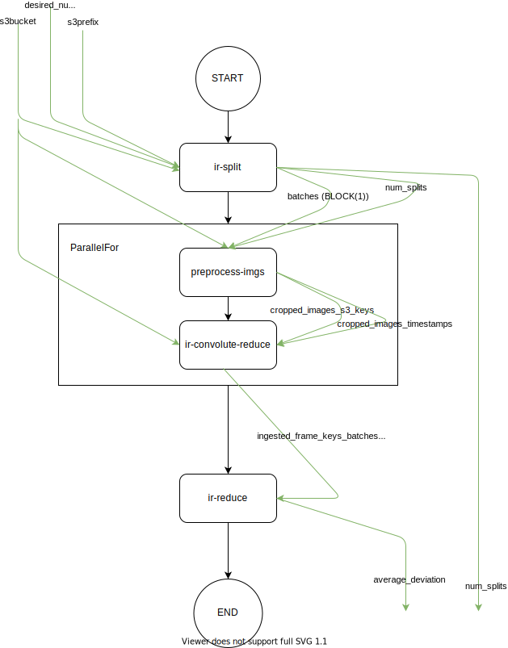

# Image Convolution

This workflow performs industrial optical QA on a large set of input images.

#### Overview

This repository contains a parallel implementation, orchestrated with the Abstract Function Choreography Language and runnable with upcoming Enactment Engines that support free data flow.

There is one workflow flavor:
* `workflows` are aspirational workflows where the dataflow is optimized to its theoretical limit, but are not tested on the current version of xAFCL.



**Fig 1: workflow.yaml control and data flow**


#### Get the code

```
git clone https://github.com/Apollo-Workflows/Image-Recognition
cd Image-Recognition
```

#### Get an input dataset

number of images | comment | link 
----|---- | -----
200 | `52.png`, `55.png`, and `184.png` should be detected as polluted |  [datasets/200](https://github.com/Apollo-Workflows/Image-Recognition/tree/master/datasets/200)
400 | `98.png` and `121.png` should be detected as polluted |  [datasets/400](https://github.com/Apollo-Workflows/Image-Recognition/tree/master/datasets/400)


Then, update `input.json` with the desired parallelism. The default is 2. This yields a 100 images per 1 convolution function ratio for the dataset.


```
{
  "desired_num_splits": 1     // <---
  "s3bucket": "YOUR_BUCKET",
  "s3prefix": "YOUR/PREFIX",
  "topic_arn": "YOUR_TOPIC",
  "region": "us-east-2",
}
```

#### Deploy the serverless functions

The serverless functions are in `js-functions-amazon`, `js-functions-google` and `py-functions-amazon` and `py-functions-google`. You can deploy a mix of them to Amazon and Google, but deploy all functions from `js` and `py`.

Take note that you properly deploy the functions, as is practice (Python: `requirements.txt`, JavaScript: `package.json`).

#### Run the workflow

The current version of the [xAFCL Enactment Engine](https://github.com/sashkoristov/enactmentengine) does not yet support the data flow. Please come back later!


<!--
Open `workflow.yaml`, and update the `resource` fields to the ARNs of your deployed Lambdas. You can find the URIs in your AWS Lambda Console or in your Google Cloud Console.

```yaml
 ...
 properties:
    - name: "resource"
      value: "arn:aws:lambda:XXXXXXXXXXXXXXXXXXXXXX:sentim-inference"
 ...
```

Then, you can run the workflow:

```
$ java -jar YOUR_PATH_TO_xAFCL.jar ./workflow.yaml ./input.json
```

-->

#### References
